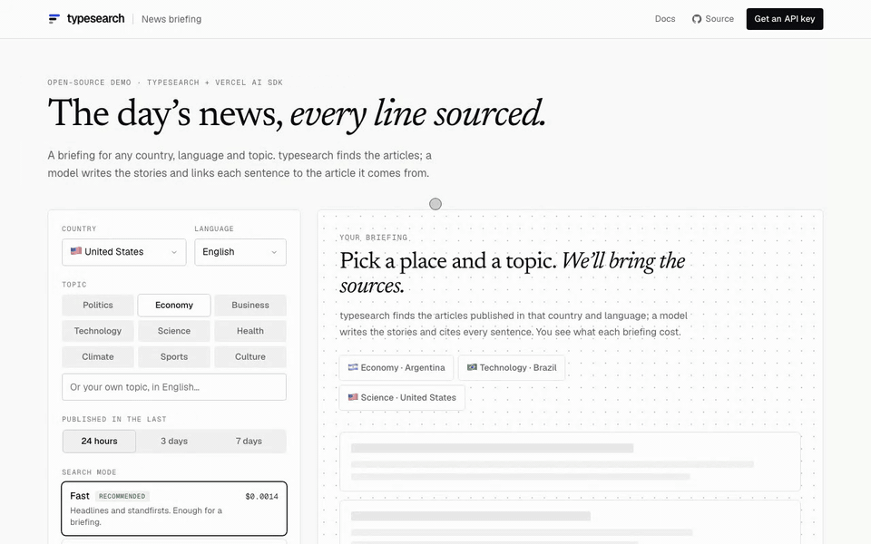
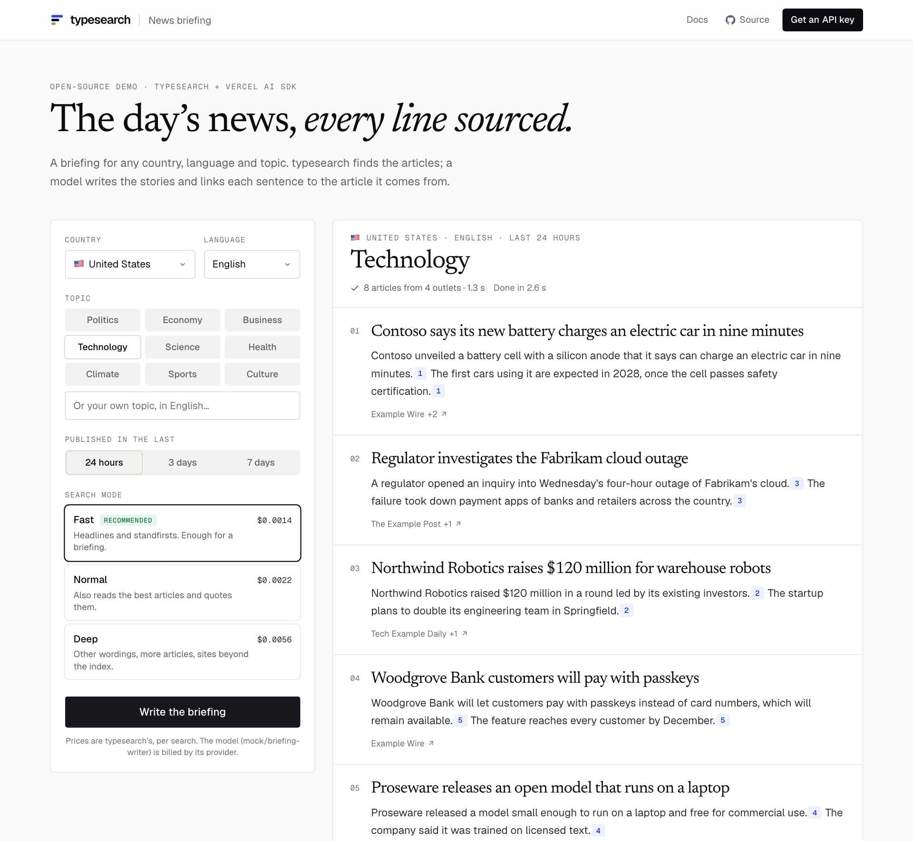

# News briefing

**The day's news for any country, language and topic — with every sentence linked to the article it
comes from.** An open-source demo of [typesearch](https://typesearch.ai), the news search API for AI
agents, and the [Vercel AI SDK](https://ai-sdk.dev).

[](https://vercel.com/new/clone?repository-url=https%3A%2F%2Fgithub.com%2Ftypesearch%2Fnews-briefing&env=TYPESEARCH_API_KEY&envDescription=Your%20typesearch%20API%20key.%20The%20model%20runs%20on%20the%20Vercel%20AI%20Gateway%20with%20no%20extra%20key.&envLink=https%3A%2F%2Fapp.typesearch.ai&project-name=news-briefing&repository-name=news-briefing)



<sub>The recording uses the demo's sample mode: fictional outlets on `.example` domains and made-up companies.</sub>

## What it does

1. **Pick a country, a language and a topic** (or write your own), and how far back to look.
2. **typesearch finds the articles** published there, in that language, with one call:

   ```ts
   const res = await ts.search('technology', {
     mode: 'fast',        // headlines and standfirsts: enough for a briefing, and the cheapest mode
     days: 1,
     countries: ['US'],
     languages: ['en'],
     dedupe: true,        // the same story from several outlets comes once, with the others in `duplicates`
     max_results: 20,
   });
   ```

   Every result has a calibrated `score` (the probability that it is about the topic); the demo keeps
   those at 0.5 or more, and puts first the stories carried by more outlets.
3. **The model writes the briefing** from those articles only, as structured output
   (`streamText` with `Output.array`), one story at a time. Every sentence ends with the numbers of its
   sources, like `[3]`.
4. **Nothing uncited reaches the page.** A citation to a source that does not exist is removed; a
   story left without real citations is dropped.
5. **You see what it cost**: the typesearch search (`usage.cost_usd` in the response) and the model
   (the price the AI Gateway reports, or the tokens when you use a provider key directly).



## Run it

You need Node 22.18 or newer, a [typesearch API key](https://app.typesearch.ai) and access to a model.

```bash
git clone https://github.com/typesearch-ai/news-briefing
cd news-briefing
npm install
cp .env.example .env.local   # then fill it in
npm run dev
```

Open http://localhost:3000. To try the interface without any key, run `DEMO_MOCK=1 npm run dev`: the
API and the model answer with fictional sample data (pick Sports for the empty state, or write
«error» as the topic to see an API error).

### Environment

| Variable | | |
| --- | --- | --- |
| `TYPESEARCH_API_KEY` | required | From [app.typesearch.ai](https://app.typesearch.ai). |
| `MODEL` | optional | A `provider/model` id. Defaults to `openai/gpt-6-luna`. |
| `AI_GATEWAY_API_KEY` | locally | The [Vercel AI Gateway](https://vercel.com/ai-gateway) runs any `MODEL`. Not needed on Vercel: the project's OIDC token is used. |
| `OPENAI_API_KEY` · `ANTHROPIC_API_KEY` | optional | Call that provider directly instead, with a matching `MODEL` (`openai/…`, `anthropic/…`). |
| `TYPESEARCH_BASE_URL` | optional | Another API address, for testing. |
| `DEMO_MOCK` | optional | `1` for the fictional sample data. Ignored in Vercel production. |

## What a briefing costs

One typesearch search in the mode you pick, plus one model call of a few thousand tokens. The form
shows the typesearch list price of each mode, read from the API (`GET /v1/usage`), and each briefing
shows what it actually cost. Repeating the same briefing within 10 minutes comes from the cache and is
free. Prices: [typesearch.ai/pricing](https://typesearch.ai/pricing).

`fast` is the recommended mode: a briefing needs headlines and standfirsts. `normal` also reads the best
articles and adds short verbatim quotes; `deep` searches the topic in other words too, and the sites
beyond the index when coverage is thin.

## Before you share a deployment

The keys stay on the server, but anyone who can open the page can spend your credit. Set a monthly
spend limit for the key in the [dashboard](https://app.typesearch.ai), and turn on
[Vercel Deployment Protection](https://vercel.com/docs/deployment-protection) if the demo is only for
you or your team.

## How it's built

| File | |
| --- | --- |
| [`lib/briefing.ts`](lib/briefing.ts) | The search options, which articles go to the model, the prompt and the story check. |
| [`lib/run.ts`](lib/run.ts) | One briefing: search, write, cost. Every step is an event. |
| [`app/api/briefing/route.ts`](app/api/briefing/route.ts) | Streams those events to the page as NDJSON. |
| [`lib/citations.ts`](lib/citations.ts) | Parses `[n]` citations and drops the ones that point nowhere. |
| [`lib/model.ts`](lib/model.ts) | The model: AI Gateway, or OpenAI / Anthropic with their own keys. |
| [`lib/coverage.ts`](lib/coverage.ts) | Countries and languages with coverage (`GET /v1/sources`, aggregate counts) and prices. |
| [`components/Briefing.tsx`](components/Briefing.tsx) | The form and the briefing. |

It uses the [typesearch-js](https://www.npmjs.com/package/typesearch-js) SDK; the same search is one
HTTP call (`POST /v1/search`) from any language, or the `search_news` tool of the
[typesearch MCP server](https://typesearch.ai/docs).

```bash
npm run lint && npm run typecheck && npm test   # tests validate every request against the API's OpenAPI document
```

## License

[MIT](LICENSE)
